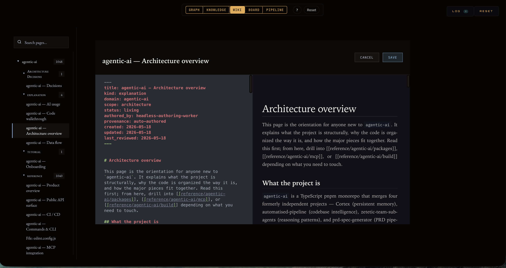
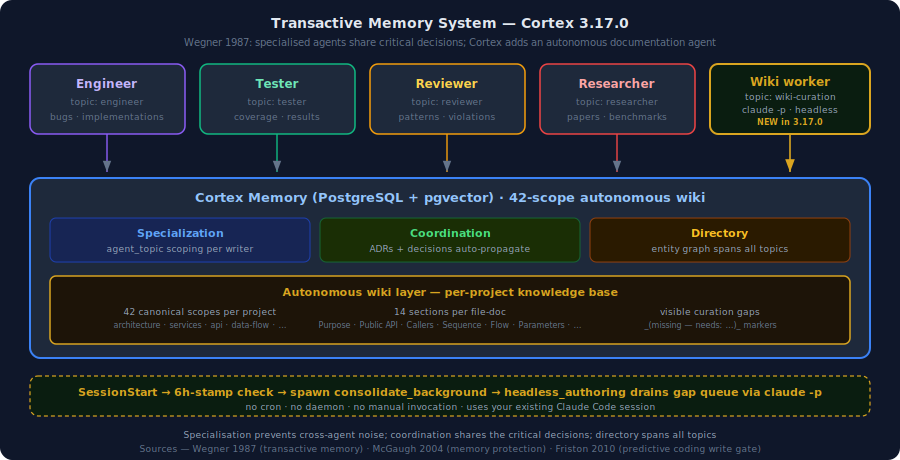
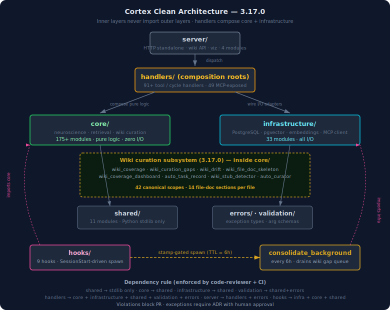

<p align="center">
  
</p>

<p align="center">
  <a href="https://github.com/cdeust/Cortex/actions/workflows/ci.yml"></a>
  <a href="LICENSE"></a>
  
  
  
  
  <a href="https://glama.ai/mcp/servers/cdeust/Cortex"></a>
</p>

<p align="center">
  <a href="#getting-started">Getting Started</a> · <a href="#whats-new">What's New</a> · <a href="#the-science-under-the-hood">Science</a> · <a href="#retrieval-that-actually-works">Benchmarks</a> · <a href="#the-views">Views</a> · <a href="#the-autonomous-wiki">Wiki</a> · <a href="#architecture">Architecture</a>
</p>

<p align="center">
  <strong>Companion projects:</strong><br>
  <a href="https://github.com/cdeust/cortex-know-when-to-stop-training-model">cortex-beam-abstain</a> — community-trained retrieval abstention model for RAG systems<br>
  <a href="https://github.com/cdeust/zetetic-team-subagents">zetetic-team-subagents</a> — specialist Claude Code agents Cortex orchestrates with<br>
  <a href="https://github.com/cdeust/automatised-pipeline">automatised-pipeline</a> — automated 11-stage pipeline (findings → PRs) that Cortex drives via <code>run_pipeline</code><br>
  <a href="https://github.com/cdeust/prd-spec-generator">prd-spec-generator</a> — stateless reducer that turns a feature description into a 9-file PRD (consumes Cortex memory + the pipeline's graph intel)
</p>

---

Claude Code forgets you every time you close the tab. Every architecture decision you explained. Every debugging session where you traced a bug through four layers of abstraction. Every "remember, we decided to use event sourcing, not CRUD" correction. Gone. Next session, you're a stranger to your own tools.

Cortex is a persistent memory engine for Claude Code built on computational neuroscience. It remembers what you worked on, how you think, what you decided and why — not as a text dump shoved into context, but as a living memory system that consolidates, forgets intelligently, and reconstructs the right context at the right time.

It runs **entirely on your machine**: PostgreSQL + pgvector, a 22 MB embedding model, no LLM in the retrieval loop, no data leaving localhost.

> **26 neuroscience mechanisms · 49 MCP tools · 9 lifecycle hooks · a self-curating per-project wiki — all local, all open-source.**

---

## Getting Started

The plugin marketplace is the **only supported install path** ([ADR-0050](docs/adr/ADR-0050-marketplace-only-no-uvx.md)):

```bash
claude plugin marketplace add cdeust/Cortex
claude plugin install cortex
```

> **PyPI / `pip install neuro-cortex-memory` is deprecated.** Kept best-effort for legacy users only and may lag the marketplace or be removed. Versions `3.14.6` and `3.14.7` on PyPI are affected by [GHSA-gvpp-v77h-5w8g](https://github.com/cdeust/Cortex/security/advisories/GHSA-gvpp-v77h-5w8g) (local ACE, CVSS 7.8) — do not use them; install via the marketplace instead.

Restart your Claude Code session, then run:

```
/cortex-setup-project
```

This handles everything: PostgreSQL + pgvector installation, database creation, embedding model download, cognitive profile building from session history, codebase seeding, conversation import, and hook registration. Zero manual steps.

After install, verify everything is wired correctly:

```bash
python3 -m mcp_server.doctor
```

Seven checks in two seconds: Python, PG driver, `DATABASE_URL`, PG connection, extensions, writable methodology dir, pool-capacity invariant. Exit 0 means ready.

> **Using Claude Cowork?** Install [Cortex-cowork](https://github.com/cdeust/Cortex-cowork) instead — uses SQLite, no PostgreSQL required.

<details>
<summary><strong>More options</strong> (Clone, Docker, Manual setup)</summary>

**Clone + setup script:**
```bash
git clone https://github.com/cdeust/Cortex.git && cd Cortex
bash scripts/setup.sh        # macOS / Linux
python3 scripts/setup.py     # Windows / cross-platform
```

**Docker:**
```bash
git clone https://github.com/cdeust/Cortex.git && cd Cortex
docker build -t cortex-runtime -f docker/Dockerfile .
docker run -it \
  -v $(pwd):/workspace \
  -v cortex-pgdata:/var/lib/postgresql/17/data \
  -v ~/.claude:/home/cortex/.claude-host:ro \
  cortex-runtime
```

**Manual:** See [detailed manual setup instructions](docs/manual-setup.md).

</details>

---

## What's new

**v3.20.0 — graph intelligence + memory knowledge-updates.** The codebase graph gains Leiden community detection, centrality and god-node analysis, and native tree-sitter symbol extraction across 7 languages — no `automatised-pipeline` dependency required. Memory learns to handle *knowledge updates*: a memory that supersedes prior knowledge records an explicit supersession edge so recall ranks the newest version above what it replaces; a MinHash entity-dedup engine (with AST-symbol origin flagging) collapses near-duplicate entities during a consolidate-time merge cycle; and a new `include_related` recall mode returns a memory's graph neighbours in one call. The visualizer adds a node-click orchestrator over an uncapped galaxy with O(1)-amortized canvas hit-testing. Supersedes the never-tagged 3.19.6 (its launcher self-heal for corrupt dependency installs and SSE-only galaxy delivery are included).

**v3.19.1 — ingest stdio pipe deadlock fix.** `ingest_codebase` could hang forever (hours at 0% CPU): a pooled MCP client bound to a closed per-call event loop was reused with a dead reader task, so once the analyzer's response exceeded the 64KB OS pipe buffer both sides slept indefinitely — the upstream cause of "graph shows only the global domain" reports. The client now detects a dead or foreign event loop and reconnects, and a new `CORTEX_MCP_CALL_TIMEOUT_S` (default 600s) makes a wedged call fail loudly in minutes with a diagnostic naming the cause.

**v3.19.0 — memory hygiene + scoring integrity.** The headline is a fix to an auto-capture scoring inversion at all three roots: prospective-trigger injection no longer harvests garbage keyword triggers from raw tool dumps; WRRF fusion excludes mechanical freshness (`post_tool_capture`) from the hot/recency pools so churn isn't mistaken for importance; and `rate_memory` feedback now wires into rank as a metamemory confidence prior (Kraaij 2002). Oversized auto-captures store a deterministic gist plus a content-addressed artifact pointer — full output one `Read` away, no truncation. The `cortex-visualize` Graph galaxy is restored alongside the live Trace view. And pytest now refuses destructive isolation against any populated non-test database, after a 2026-06-10 incident lost 537k production rows to a misconfigured CI run. Benchmarks regression-free (LongMemEval R@10 98.4% / MRR 0.916; LoCoMo MRR 0.828).

Recent releases also brought a **progressive graph build** (bounded memory, keyset streaming — no more OOM on large stores), a **self-healing automatised-pipeline MCP bridge**, **git-diff + AST symbols for any file type**, a **cross-lens Wiki graph** in the visualizer, and **CodeQL path-injection hardening**.

→ **[Full changelog and release notes](https://github.com/cdeust/Cortex/releases)**

---

## The science under the hood

Cortex doesn't store memories the way a database stores rows. It treats them the way a brain treats experiences. Every mechanism traces to a published paper — **45 citations total** ([docs/papers/science.md](docs/papers/science.md)).

**Memories have temperature.** Every memory starts hot. Access it and it stays hot; ignore it and it cools. Below a threshold it compresses: full text → summary → keywords → fades entirely. This is [rate-distortion optimal forgetting](docs/papers/science.md) — the framework your brain uses to decide what's worth keeping. Important memories resist compression; surprising ones get a heat boost; boring, redundant ones quietly disappear. *(Anderson & Lebiere 1998; Ebbinghaus 1885)*

**Storage has a gatekeeper.** Not everything deserves to be remembered. Cortex maintains a predictive model of what it already knows and only stores information that violates its expectations. Tell it the same thing twice and the write gate blocks the second attempt. This is predictive coding — the mechanism your neocortex uses to filter sensory input. Only prediction errors get through. *(Friston 2005; Bastos et al. 2012)*

**Retrieval changes the memory.** When you recall a memory in a new context, Cortex compares the retrieval context against the storage context, and if there's enough mismatch it reconsolidates — updates the memory to reflect what's true now. Nader et al. showed in 2000 that retrieved memories become labile and can be rewritten. Your codebase evolves, and so do Cortex's memories of it. *(Dudai 2012; Nader et al. 2000)*

**Emotional memories are stronger.** Frustration during debugging, urgency in a production incident — Cortex detects emotional valence and encodes those memories with more force. They decay slower, compress later, and surface faster, like how you remember your worst outage in vivid detail but not last Tuesday's standup. *(Wang & Bhatt 2024; Yerkes-Dodson 1908)*

**Background consolidation runs like sleep.** When you're away, a consolidation cycle decays old memories, compresses verbose ones, promotes recurring patterns into general knowledge (episodic → semantic transfer), discovers entity relationships, and runs "dream replay" where related memories are compared and new connections emerge. *(McClelland et al. 1995; Foster & Wilson 2006; Buzsáki 2015)*

**Similar memories stay distinct.** Pattern separation, modeled on the dentate gyrus, keeps "Tuesday's standup" separate from "Wednesday's standup" even though they're nearly identical — without it, retrieval returns the same generic match for every similar query. *(Leutgeb et al. 2007; Yassa & Stark 2011)*

The two arXiv-ready papers go deeper: **[Thermodynamic memory (PDF, 34 pages)](docs/arxiv-thermodynamic/main.pdf)** · **[Structured context assembly (PDF, 39 pages)](docs/arxiv-context-assembly/main.pdf)**.

---

## What this actually feels like

**Monday.** You spend an hour debugging a webhook handler. After tracing through four layers, you find the root cause: a race condition in the Redis session store where TTL expiry can fire between the auth check and the permission lookup. You discuss the fix with Claude, decide on an approach, implement it. Session ends.

**Thursday.** Different project, but a user reports intermittent logouts. You open Claude Code. Before you even describe the bug, Cortex has already injected three memories: Monday's race-condition analysis, a decision from two weeks ago to use Redis for all session state, and a lesson from an older session about TTL edge cases in distributed caches.

Claude doesn't just have your conversation history. It has *context* — it connects the current problem to past decisions and skips the part where you re-explain your architecture.

**Three weeks later.** Those debugging sessions have consolidated into a general pattern: "authentication edge cases involving TTL-based caches." The specific Redis commands compressed to a summary, the debugging steps faded, the principle survived. Your next auth issue starts with institutional knowledge, not a blank page.

---

## Retrieval that actually works

We tested Cortex against three published benchmarks. All scores are **retrieval-only** — no LLM reader in the evaluation loop. We measure whether the right memory shows up, not whether a model can generate a good answer from it.

### LongMemEval — can you find a fact from 40 sessions ago?

LongMemEval (Wu et al., ICLR 2025): 500 human-curated questions embedded in ~40 sessions of conversation history (~115k tokens). The paper's best retrieval hit 78.4% Recall@10.

| | Cortex | What it means |
|---|---|---|
| Recall@10 | **98.4%** | The right memory shows up in the top 10 for nearly every question |
| MRR | **0.916** | The correct answer is usually the first or second result |

<sub>n=500, E1 v3 verification campaign — per-row JSONs with code SHAs in `benchmarks/results/ablation/longmemeval-s_v3/`. Re-verified on a clean DB 2026-06-10.</sub>

| Category | MRR | R@10 |
|---|---|---|
| Single-session (assistant) | 1.000 | 100.0% |
| Multi-session reasoning | 0.962 | 100.0% |
| Knowledge updates | 0.925 | 100.0% |
| Temporal reasoning | 0.926 | 98.5% |
| Single-session (user) | 0.814 | 94.3% |
| Single-session (preference) | 0.668 | 93.3% |

Knowledge updates score near-perfect because the retrieval stack's recency signal and update-intent routing push the newest version of a fact above older ones.

### LoCoMo — trick questions and multi-hop reasoning

LoCoMo (Maharana et al., ACL 2024): 1,986 questions across 10 conversations — adversarial trick questions, multi-hop queries needing evidence from multiple turns, and temporal reasoning.

| | Cortex | What it means |
|---|---|---|
| Recall@10 | **94.3%** | Right memory in top 10 over 9 times out of 10 |
| MRR | **0.828** | Correct answer is typically the first result |

<sub>n=1986, BASELINE_NO_CONSOLIDATION, post-plasticity-fix — `tasks/e1-v3-locomo-results-post-fix.md`.</sub>

| Category | MRR | R@10 |
|---|---|---|
| Adversarial | 0.881 | 96.0% |
| Open-domain | 0.875 | 96.9% |
| Multi-hop | 0.779 | 90.3% |
| Single-hop | 0.741 | 94.0% |
| Temporal | 0.577 | 78.3% |

No LLM at query time. Five signals fused server-side in PL/pgSQL — vector similarity, full-text search, trigram matching, thermodynamic heat, recency — then reranked by a cross-encoder.

### BEAM — 10 million tokens of conversation

BEAM (Tavakoli et al., ICLR 2026) is the hardest long-term memory benchmark published: 10 conversations, each spanning 10 million tokens, probed across 10 memory abilities — including three no prior benchmark tests: contradiction resolution, event ordering, and instruction following. (Question counts vary by split: 196 on 10M, 395 on the current 100K.)

Every system in the paper collapses at this scale; the best reported (LIGHT on Llama-4-Maverick) scores 0.266 end-to-end. **The collapse is measurable — and structured assembly resists it.** Same code, same day, clean database, 35 conversations per split:

| Split | Flat WRRF | With Context Assembler | Δ |
|---|---|---|---|
| 500K (699 Qs) | 0.500 | **0.570** | +0.070 |
| 1M (695 Qs) | 0.466 | **0.535** | +0.069 |

<sub>Measured 2026-06-11 — `benchmarks/results/beam_crossover/RESULTS.md`. Flat retrieval degrades as the corpus doubles (0.500 → 0.466); the assembler holds a durable +0.07. At small scale it is net-flat (April 100K: 0.591 flat vs 0.602 assembled, 200-Q split since re-based to 395) — the value is scale-dependent, not universal.</sub>

**At 10M tokens the gap widens — and the assembler needs no labels:**

| Configuration | MRR | vs. flat WRRF (0.353) |
|---|---|---|
| Flat WRRF baseline | 0.353 | — |
| Assembler, oracle stage labels (BEAM `plan_id`) | 0.429 | +21.5% |
| Assembler, **temporal stage detection (timestamps only)** | **0.471** | **+33.4%** |

<sub>2026-04 family, same code revision, 196 Qs / 10 conversations — `benchmarks/beam/variance/assembler_10m_stagefixed.txt` and `assembler_10m_temporal.txt`. Reproduced 2026-06-11 on current code (fresh DBs, same 196 Qs): oracle 0.496, temporal **0.523** — the temporal advantage persists across code revisions (`benchmarks/results/beam10m_paired/RESULTS.md`).</sub>

The finding that surprised us: **label-free temporal day-level partitioning outperforms BEAM's ground-truth topic labels** (0.471 vs 0.429). Temporal proximity is a stronger stage signal than topic boundaries for conversational memory, so the [Structured Context Assembly](docs/research-post-context-assembly.md) architecture deploys without any oracle metadata. It was originally designed in September 2025 for 9-page PRDs on Apple Intelligence's 4,096-token window ([ai-prd-builder](https://github.com/cdeust/ai-prd-builder), commit [`462de01`](https://github.com/cdeust/ai-prd-builder/commit/462de01)) — one month before the BEAM paper existed — because the problem is the same at both scales: you can't fit everything in context, so you have to be smart about what goes in.

> **Honest caveat:** BEAM defines no retrieval MRR metric — the paper uses LLM-as-judge nugget scoring. Our "MRR" is a retrieval proxy (rank of the first substring-matching memory); LIGHT's scores are end-to-end QA. The two are *not* commensurable, so we make no head-to-head BEAM claim and use BEAM only for within-system, same-harness comparisons.

<details>
<summary>Running benchmarks yourself</summary>

```bash
pip install -e ".[postgresql,benchmarks,dev]"

python benchmarks/beam/run_benchmark.py --split 100K          # ~10 min
CORTEX_USE_ASSEMBLER=1 python benchmarks/beam/run_benchmark.py --split 10M
python benchmarks/locomo/run_benchmark.py                     # ~40 min
python benchmarks/longmemeval/run_benchmark.py --variant s    # ~45 min
```

All scores on a fresh database (DROP + CREATE per run), TRUNCATE between conversations, FlashRank preflight verified. Full methodology: [docs/research-post-context-assembly.md](docs/research-post-context-assembly.md).

</details>

---

## Context that survives compaction

Claude Code has a 200k/1M token context window. During long sessions, when it fills, it compacts: summarizes older messages, strips tool outputs, paraphrases instructions. Important nuance evaporates; decisions you anchored early dissolve into vague summaries.

**Hippocampal Replay** fixes this — named after the phenomenon where your brain replays important experiences during sleep to consolidate them. It treats compaction as "sleep" and replays what matters when Claude "wakes up." Before compaction hits, a hook drains your active context — what you were working on, which files were open, what decisions you'd made, what errors were unresolved — and stores it as a checkpoint. After compaction, a second hook reconstructs context intelligently: the latest checkpoint, anything you'd anchored as critical, the hottest project memories, and predictions about what you'll need next.

You can be explicit about what matters:

```
cortex:anchor({ content: "We're using event-sourcing. All state changes go through the event bus.", reason: "Architecture constraint" })
```

Anchored memories get maximum protection — they always survive compaction, no matter what.

---

## The views

Launch with `/cortex-visualize`. One launcher opens six reading angles over the same data; the default landing view is **Graph**.

<p align="center">

</p>

### Graph — the Claude workflow map

Each project becomes a **cloud of nodes** around one gold domain hub. Inside every cloud, nodes sit in six concentric levels by the Claude surface (or the code itself) that produced them:

| Level | What's there | Click through to |
|---|---|---|
| **L1 · Setup** | Skills · Commands · Hooks · Agents · MCPs | File paths; which domains share an MCP (thin indigo bridges) |
| **L2 · Tools** | One hub per Claude tool per domain (Edit · Write · Read · Grep · Glob · Bash · Task) | Files touched + total uses |
| **L3 · Files** | Every file Claude opened, read, edited, searched, or referenced — colored by primary tool | `first_seen` / `last_accessed` / `last_modified` + **See diff against HEAD** |
| **L4 · Discussions** | One node per Claude Code session | `started_at`, duration, message count + **View full conversation** replay |
| **L5 · Memories** | Persistent memories, colored by consolidation stage | Full content, tags, every scientific measurement |
| **L6 · AST symbols** | The code itself — functions, methods, classes, modules, constants parsed from 10 languages (Rust, Python, TypeScript, Java, Kotlin, Swift, Objective-C, C, C++, Go) | Qualified name, symbol type, parent file, and named `defined_in` / `calls` / `imports` / `member_of` edges |

**Why L6 matters.** L5 and below tell you *what Claude did*; L6 tells you *what the code is*. Three things become visible for free: **shared code** (any symbol referenced by two projects drifts into the inter-project gap), **impact** (clicking a symbol surfaces every caller, importer, and member — "what breaks if I change this?" is a graph neighbourhood, not a grep), and **the shape of the codebase itself** (a dense petal around a file means a fat internal API; a thin one means a leaf module). A grouped filter (`L1–L6` / by kind / by AST edge kind / `Cross-domain`) isolates any slice; the graph rebuilds every ~2 minutes from the `PostToolUse` hook.

<p align="center">

</p>

### Board — consolidation as a kanban

Five columns by consolidation stage (`labile` · `early_ltp` · `late_ltp` · `consolidated` · `reconsolidating`). Each header reads live bucket metrics — decay rate, vulnerability, plasticity, heat / importance / encoding / interference medians, hippocampal dependency, replay count — with the advancement rule (`replay ≥ 3`, `DA ≥ 1 or imp > 0.3`) printed under the bar. Cards carry heat, importance, surprise, valence, arousal, and the exact tool that created the memory.

<p align="center">

</p>

**Detail panel — every measurement explained.** Clicking any node opens a modal with the raw value *and* a one-line plain-language explanation. Consolidation stage, activity (heat), importance, surprise, emotional tone and intensity, confidence, plasticity, stability — each a labeled bar with a sentence like *"How unexpected this memory was when it arrived. Surprises stick better than routine events."*

### The other three

- **Knowledge** — curated memory cards with heat-based borders, emotion tags, and evidence file references; filter by domain or emotion, click any card for a full detail panel.
- **Wiki** — the per-project knowledge base as a browsable Project → Kind → Pages tree, with a coverage grid on the welcome screen. It's the front end of the [autonomous wiki](#the-autonomous-wiki) below; edit any page in the split-pane [authoring environment](#write-papers-in-cortex).
- **Pipeline** — a horizontal Sankey from domains through the write gate into consolidation stages; ribbon width = memory volume, so retention and drop-off are visible at a glance.
- **Trace** — the live execution-trace drill: collapsed domain hubs → sessions → the ordered prompt → action → file chain of what actually happened → a file's AST symbols, impact neighbourhood, and git history. Served live from session JSONL, the code graph, and git on every request — no snapshots, always current.

---

## The autonomous wiki

Cortex's wiki is **a self-curating per-project knowledge base**, not a memory dump. Every project the registry knows is driven toward **42 canonical documentation scopes** (product overview, architecture, services, API, data flow, operations, decisions, onboarding, security, testing, configuration … ), and every source file toward **13 canonical sections** (Purpose · Public API · Dependencies · Callers · How it works · Invariants · What can go wrong · Tests · Sequence diagram · Flow diagram · Parameters · Request example · Response example).

<p align="center">

</p>

What makes it autonomous — no cron, no daemon, no manual invocation:

- **A `SessionStart` hook spawns a background `consolidate` cycle** every 6 hours (TTL stamp at `~/.claude/methodology/.last_consolidate`). The agent runs because you opened Claude Code, and stops when nothing is left to author.
- **A curation-gap detector + headless authoring worker.** Each file-doc page declares its missing sections in frontmatter (`curation_gaps:`); the worker drains them by invoking `claude -p` (your existing credentials, no API key), which calls the codebase-intelligence MCP tools — `codebase_context`, `codebase_impact`, `codebase_query` — to ground each section in the real call graph before writing.
- **Missing-anchor authoring.** When a project has no architecture / services / api / data-flow / operations / ADR / PRD page, the worker authors it from the source tree (structure + README + manifest + `CLAUDE.md`), same grounding.
- **Drift detection.** Pages whose cited source moved, whose mtime is stale (>60 days), or whose body is off-template are flagged and re-authored in place. Deletion is never the policy; **visibility** is — a yellow banner shows `⚠ Page N% curated — M sections still missing` and exactly what belongs in each.
- **ADRs as task-records.** Every completed task (≥1 commit at session end) auto-drafts an ADR with five mandatory sections (Entry / Mandatory / How / Result / Serves) from commit subjects + the session's memories; the worker refines it next cycle.
- **Per-project dashboards** at `wiki/_dashboards/<project>.md` show slot-fill rate, file coverage %, open gaps, and the queue for the next cycle.

This isn't documentation you write — it's documentation Cortex authors and verifies for you, every 6 hours, until every project reaches full scope coverage and every source file has all 13 sections filled.

### Write papers in Cortex

Every page is editable in place in a full scientific writing environment — the same markdown that feeds the memory pipeline, with a rendering layer on top that never steals your content into a proprietary format. Your `.md` files stay grep-able, diffable, and git-versioned.

<p align="center">

</p>

- **CodeMirror 6 split-pane editor** — syntax-highlighted markdown on the left, fully-rendered article on the right, atomic round-trip to the `.md` file on disk.
- **Structured frontmatter** — `kind` / `domain` / `scope` / `status` / `authored_by` / `provenance` / `created` / `updated` / `last_reviewed`. Real metadata: the coverage audit, dashboards, and wiki view all read it.
- **`[[wiki/path]]` cross-references** rendered as clickable links (bare slugs route to filtered search), with a backlinks footer.
- **Mermaid diagrams with a 🔍 lens** — viewport-sized viewer with wheel-zoom, drag-pan, and keyboard shortcuts.
- **LaTeX math** via KaTeX, **BibTeX citations** (`[@friston2010]` → `(Friston 2010)` with an auto APA bibliography), and **figure / equation / table auto-numbering** with cross-refs.
- **Pandoc export** — one click to PDF (via LaTeX), TEX, DOCX, or HTML. Journal-submittable from the same source.

---

## Agent Integration

Cortex works with teams of specialized agents — and it **uses one itself**: the headless wiki worker is a Claude agent that drains the curation queue every six hours (see [the autonomous wiki](#the-autonomous-wiki)). Memory is shared across a team via Wegner's transactive-memory model (1987): teams store more than individuals because each member specializes.

- **Specialization** — each agent writes to its own `agent_topic`. Engineer's debugging notes don't clutter tester's recall; the wiki worker writes to `agent_topic=wiki-curation` so its drafts stay out of interactive recall.
- **Coordination** — decisions auto-protect and propagate. When engineer decides "use Redis over Memcached," every agent sees it at next session start. The ADRs the worker drafts at session end *are* the cross-agent shared memory.
- **Directory** — entity-based queries span all topics. "What do we know about the reranker?" returns results from engineer, tester, researcher, and the worker's drafts alike.

<p align="center">

</p>

Works with any custom agents. See [zetetic-team-subagents](https://github.com/cdeust/zetetic-team-subagents) for a ready-made team of **27 specialists**, each with scoped memory.

---

## Architecture

Clean Architecture with strict dependency rules — inner layers never import outer layers.

<p align="center">

</p>

| Layer | What lives here | Modules |
|---|---|---|
| **shared/** | Pure utilities (text, hash, similarity, types) | 18 |
| **core/** | Neuroscience + retrieval + wiki-curation logic | 177 |
| **core/context_assembly/** | Structured context assembler + stage detector | 10 |
| **infrastructure/** | PostgreSQL, embeddings, file I/O, MCP client | 59 |
| **handlers/** | MCP tools + consolidation cycles (49 MCP-exposed) | 105 |
| **hooks/** | Lifecycle automation (incl. autonomous consolidate spawn) | 9 registered |
| **server/** | HTTP standalone + wiki API + visualization | 29 |
| **observability/** | Prometheus text-format metrics | 2 |

**Storage:** PostgreSQL 15+ with pgvector (HNSW) and pg_trgm. All retrieval in PL/pgSQL stored procedures — WRRF fusion, vector search, FTS, trigram, heat, recency, all server-side.

**Concurrency:** `psycopg_pool.ConnectionPool` with two latency classes — `interactive_pool` (min=2, max=8) for recall/remember/anchor, `batch_pool` (min=1, max=2) for consolidate/ingest. Tool handlers run on worker threads via `asyncio.to_thread`; per-tool admission semaphores bound fan-out. Heat is computed at read time by `effective_heat()`, so homeostatic maintenance writes one scalar per domain per run instead of N rows.

**Configuration:** set `DATABASE_URL` (default `postgresql://localhost:5432/cortex`); all parameters use the `CORTEX_MEMORY_` prefix — see `mcp_server/infrastructure/memory_config.py`. Wiki cycle TTL is `CORTEX_CONSOLIDATE_TTL_HOURS` (default 6h).

---

## Verification

Every benchmark headline above is backed by a per-mechanism ablation campaign — full *n*, single-seed, with code SHAs, dirty flags, manifests, and per-row JSON preserved:

- **LongMemEval-S, 17 rows, n=500** — `tasks/e1-v3-results.md`. Per-mechanism deltas at the calibrated equilibrium + category-specialization analysis.
- **LoCoMo, 14 rows, n=1986** — `tasks/e1-v3-locomo-results.md` (pre-fix) and `tasks/e1-v3-locomo-results-post-fix.md` (post plasticity result-shape fix). Two-baseline design (NO_CONSOLIDATION / WITH_CONSOLIDATION).

The full per-mechanism evidence lives in the thermodynamic paper (§6.3); the BEAM decay dose-response (§6.4) documents a re-scoped negative result after a dirty-store confound was caught and traced. **[Thermodynamic memory (PDF, 34 pages)](docs/arxiv-thermodynamic/main.pdf)** · **[Structured context assembly (PDF, 39 pages)](docs/arxiv-context-assembly/main.pdf)**.

---

## Security

Runs **100% locally** — MCP over stdio, PostgreSQL on localhost, visualization bound to 127.0.0.1. No data leaves your machine. Audit score: **91/100**.

## Development

```bash
pytest                    # 3,000+ tests
ruff check .              # Lint
ruff format --check .     # Format
```

## License

MIT

## Citation

The paper PDFs on `main` are the canonical artefacts (arXiv IDs forthcoming, endorsement in progress):

```bibtex
@software{cortex2026,
  title={Cortex: Persistent Memory for Claude Code},
  author={Deust, Clement},
  year={2026},
  url={https://github.com/cdeust/Cortex}
}

@unpublished{deust2026thermodynamic,
  title={Thermodynamic Memory for Conversational Agents:
         A Per-Mechanism Ablation Study on LongMemEval and LoCoMo},
  author={Deust, Clement},
  year={2026},
  note={arXiv ID forthcoming, endorsement in progress},
  url={https://github.com/cdeust/Cortex/blob/main/docs/arxiv-thermodynamic/main.pdf}
}

@unpublished{deust2026context,
  title={Structured Context Assembly for Long-Horizon Conversational Memory},
  author={Deust, Clement},
  year={2026},
  note={arXiv ID forthcoming, endorsement in progress},
  url={https://github.com/cdeust/Cortex/blob/main/docs/arxiv-context-assembly/main.pdf}
}
```
